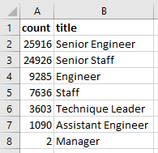

# Pewlett-Hackard-Analysis

# Overview 
The purpose of this analysis is to determine the number of retiring employees by title and identify the employees who are eligible for a mentorship program. This is necessary so Pewlett-Hackard can help mitigate loss of a large knowledge base in their workforce that many of their current employees who are nearing retirement age have. 

# Results: 

(1) The Number of Retiring Employees by Title

    (a) There are 72,458 people retiring. 

    (b) The job title with the most amount of people retiring is Senior Engineer and the the job title with the least amount of people retiring is manager. See table below for breakdown of the number of people retiring by title that was generated using a query in Postgres. 

(2) The Employees Eligible for the Mentorship Program

    (a) There are only 1,549 employees who were born in 1965 who are eligible for a mentorship program.
    
    (b) This about 2% of the retirement-ready employees at PH who are eligible for a mentorship program. 

# Summary: 

Over 72,000 positions need to be filled in the upcoming "silver tsunami". Based on birth year of 1965, there currently is not enough qualified, retirement-ready employees in the departments to mentor the next generation of Pewlett Hackard employees. 

While birth year may indicate that one is a qualified, retirement-ready employee who can mentor, it should not be the defining characteristic. Mentorship eligibility should be based on years of service to the company and how long each person has held their current role. Further analysis needs to be completed to see how many years overall any employee has worked for Pewlett Hackard. From there, it can also be determined how many years each employee has held a specific role. With that information, if an employee has x number of years in y role, they then can be considered a mentor, regardless of their birth year. This will ensure that employees are properly trained to backfill roles that retirement-ready employees hold and doesn't require the retirement-ready employees only to be able to train and mentor, since it has already been shown through this analysis that there just aren't enough of them to do so. 